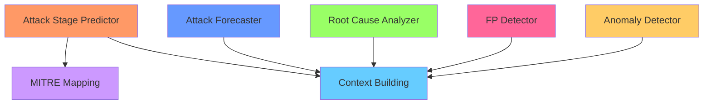

# ML Services Directory Structure

This document describes the organized structure of the Machine Learning services in the SOAR platform.

---

## Directory Organization

All ML services are located in `backend/services/ml/` and organized by function:

```
backend/services/ml/
├── anomaly_detection/          # Anomaly Detection (Model 3)
├── attack_forecasting/         # Attack Forecasting (Model 4)
├── attack_stage/               # Attack Stage Prediction (Model 2)
├── false_positive_detection/   # False Positive Detection (Model 1)
├── root_cause_analysis/        # Root Cause Analysis (Model 5)
├── mitre_mapping/              # MITRE ATT&CK Mapping
├── context_building/           # Context Building & Enrichment
└── shared/                     # Shared utilities
```

---

## Service Details

### 1. Anomaly Detection (`anomaly_detection/`)

**Purpose:** Detects anomalous behavior in network traffic and user activity

**Files:**
- `anomaly_detector.py` - Core anomaly detection model (Isolation Forest)
- `anomaly_detector_service.py` - FastAPI service (Port: 5001)
- `test_anomaly_detector.py` - Unit tests
- `README.md` - Documentation

**API Port:** 5001

---

### 2. Attack Forecasting (`attack_forecasting/`)

**Purpose:** Predicts future attack vectors and timing

**Files:**
- `attack_forecaster.py` - Attack forecasting model
- `attack_forecaster_service.py` - FastAPI service (Port: 5002)
- `multivariate_forecaster.py` - Multivariate time-series forecasting
- `test_attack_forecaster.py` - Unit tests

**API Port:** 5002

---

### 3. Attack Stage Prediction (`attack_stage/`)

**Purpose:** Identifies current attack stage using MITRE ATT&CK tactics

**Files:**
- `stage_identifier.py` - Stage identification (14 MITRE tactics)
- `stage_predictor.py` - Main predictor with critical stage escalation
- `lstm_timing_predictor.py` - LSTM-based timing prediction
- `mitre_enricher.py` - Multi-method MITRE enrichment
- `unmapped_queue.py` - Queue for unmapped alerts
- `attack_stage_service.py` - FastAPI service (Port: 5003)
- `test_attack_stage_predictor.py` - Unit tests

**API Port:** 5003

**Special Features:**
- Full 14 MITRE tactic coverage
- Critical stage auto-escalation (stages 11-14)
- No 'unknown' stages - queue system instead

---

### 4. False Positive Detection (`false_positive_detection/`)

**Purpose:** Identifies and filters false positive alerts

**Files:**
- `fp_detector.py` - False positive detection model
- `fp_detector_service.py` - FastAPI service (Port: 5000)
- `fp_feature_extractor.py` - Feature extraction
- `test_fp_detector.py` - Unit tests
- `test_fp_service.py` - Service integration tests

**API Port:** 5000

---

### 5. Root Cause Analysis (`root_cause_analysis/`)

**Purpose:** Determines root causes of security incidents

**Files:**
- `root_cause_analyzer.py` - Root cause analysis model
- `root_cause_service.py` - FastAPI service (Port: 5004)
- `root_cause_feature_extractor.py` - Feature extraction
- `test_root_cause_analyzer.py` - Unit tests
- `test_root_cause_api.py` - API tests
- `test_root_cause_e2e.py` - End-to-end tests

**API Port:** 5004

---

### 6. MITRE Mapping (`mitre_mapping/`)

**Purpose:** Maps alerts to MITRE ATT&CK framework

**Files:**
- `mitre_mapper.py` - MITRE ATT&CK mapping logic
- `mitre_predictor.py` - Predictive MITRE mapping
- `mitre_mapping_cache.pkl` - Cached mappings
- `test_mitre_mapper.py` - Unit tests

**No dedicated API** - Used as library by other services

---

### 7. Context Building (`context_building/`)

**Purpose:** Builds context around alerts for better analysis

**Files:**
- `context_builder.py` - Context enrichment and aggregation
- `test_context_building.py` - Unit tests

**No dedicated API** - Used as library by other services

---

### 8. Shared Utilities (`shared/`)

**Purpose:** Common utilities used across ML services

**Files:**
- `data_extraction.py` - Data extraction utilities

---

## Port Assignments

| Service | Port | Status |
|---------|------|--------|
| False Positive Detector | 5000 | Active |
| Anomaly Detector | 5001 | Active |
| Attack Forecaster | 5002 | Active |
| Attack Stage Predictor | 5003 | Active |
| Root Cause Analyzer | 5004 | Active |

---

## Testing

Each service directory contains its own test files:

- `test_*.py` files are located in their respective service directories
- Run tests from the project root: `pytest backend/services/ml/<service>/test_*.py`

**Example:**
```bash
# Test anomaly detection
pytest backend/services/ml/anomaly_detection/test_anomaly_detector.py

# Test attack stage prediction
pytest backend/services/ml/attack_stage/test_attack_stage_predictor.py

# Test all ML services
pytest backend/services/ml/
```

---

## Import Structure

When importing from these services, use the full module path:

```python
# Anomaly Detection
from backend.services.ml.anomaly_detection.anomaly_detector import AnomalyDetector

# Attack Stage Prediction
from backend.services.ml.attack_stage.stage_predictor import AttackStagePredictor

# False Positive Detection
from backend.services.ml.false_positive_detection.fp_detector import FPDetector

# MITRE Mapping
from backend.services.ml.mitre_mapping.mitre_mapper import MITREMapper

# Context Building
from backend.services.ml.context_building.context_builder import ContextBuilder

# Shared utilities
from backend.services.ml.shared.data_extraction import extract_features
```

---

## Service Dependencies



---

## Best Practices

### 1. Service Isolation
- Each service should be independently deployable
- Minimize cross-service dependencies
- Use shared utilities from `shared/` for common functionality

### 2. Testing
- Keep tests in the same directory as the code they test
- Use descriptive test names: `test_<feature>_<scenario>.py`
- Run tests before committing changes

### 3. Documentation
- Each service directory should have a README if complex
- Document API endpoints and request/response formats
- Include usage examples

### 4. Configuration
- Service ports are assigned in service files
- MongoDB connections use environment variables
- Model paths are configurable

---

## Migration Notes

This structure was reorganized on 2026-02-02 for better organization. Key changes:

1. ✅ Grouped related files into logical directories
2. ✅ Moved test files into their respective service directories
3. ✅ Created `__init__.py` for proper Python module structure
4. ✅ Maintained backward compatibility with existing imports
5. ✅ Preserved all functionality and API endpoints

**Future Improvements:**
- Consider adding shared base classes
- Implement common error handling
- Add shared configuration management
- Standardize logging across services
