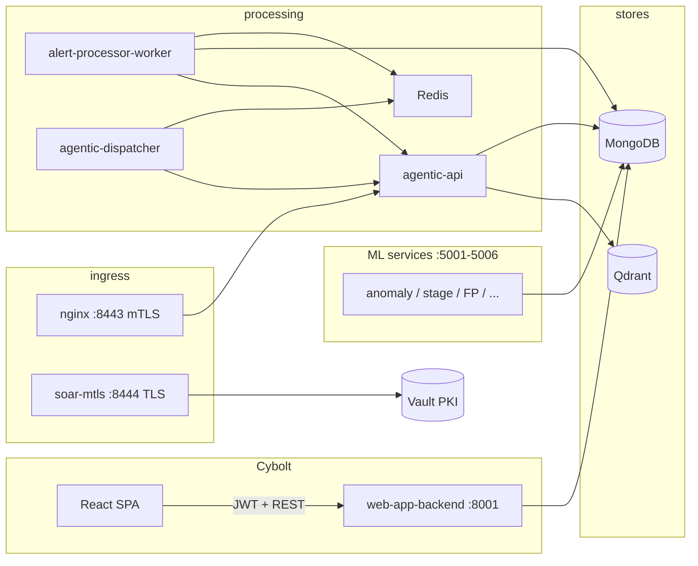

# AI-SOC / Cybolt — Platform Architecture (CTO Technical Brief)

This document traces the system from **container images and Dockerfiles** through **core SOAR services** to the **Cybolt web application**, for architecture reviews and onboarding.

---

## 1. Executive summary

| Layer | Role |
|--------|------|
| **Docker Compose** | Single `soar-network` bridge; orchestrates data stores, LLM, ML microservices, agentic pipeline, mTLS API, Vault PKI, monitoring, and the **web-app backend**. |
| **Monorepo `backend/`** | Python 3.11 SOAR core: ingestion (Redis → workers), normalization, agentic workflow API, optional legacy `api.main` routes, ML model services, **mTLS FastAPI** on 8443. |
| **`web_app/`** | **Cybolt**: slim Python 3.12 FastAPI (**8001** host) + React/Vite SPA; JWT auth, RBAC, dashboards, **processed alerts**, incidents, **analyst feedback** → MongoDB `feedback_collection`. |
| **Frontend delivery** | SPA is **not** defined in `docker-compose.yml` by default; built with Vite and served via `npm run dev` / static hosting, with `VITE_API_URL` pointing at the web-app backend. |

The platform is **container-first**: most SOAR processes expect MongoDB, Redis, and (for full AI paths) Ollama and Qdrant.

---

## 2. Repository layout (mental map)

```
AI-SOC/
├── docker-compose.yml          # Primary orchestration
├── .env / .env.example         # Secrets & service URLs (compose + apps)
├── backend/                    # SOAR monolith (Python)
│   ├── Dockerfile              # Image: soar-backend:latest (agentic, workers, ML, …)
│   ├── api/                    # Optional FastAPI app (api.main) — commented in compose
│   ├── services/
│   │   ├── agentic/            # Workflow API + dispatcher
│   │   ├── ingestion/          # Stream worker, pipelines, normalisation
│   │   ├── mtls/               # mTLS certificate API (uvicorn on 8443 in compose)
│   │   └── ml/                 # Anomaly, attack stage, FP, RCA, asset risk, forecasting
│   └── requirements.txt
├── web_app/
│   ├── backend/                # Cybolt API
│   │   ├── Dockerfile          # Python 3.12-slim, uvicorn app.main:app
│   │   └── app/                # FastAPI routers (auth, alerts, incidents, …)
│   └── frontend/               # React 19 + Vite + TanStack Query + Zustand
├── infra/
│   ├── docker/nginx/           # Reverse proxy / mTLS ingress
│   ├── docker/vault/           # PKI bootstrap + ACL policy scripts
│   └── monitoring/             # Prometheus, Grafana, Loki configs
└── scripts/setup/              # mongo-init.js, init_db.py, etc.
```

---

## 3. Dockerfiles (what each image is)

### 3.1 `backend/Dockerfile` (image tag: **`soar-backend:latest`**)

- **Base:** `python:3.11-slim`
- **Build:** installs build tools; pre-installs **CPU-only PyTorch** from PyTorch index (keeps image smaller than CUDA); then `backend/requirements.txt`; `COPY . .` at repo root context
- **Runtime user:** non-root `soar` (uid 1000)
- **Expose:** 8000 (individual compose commands override/bind ports)
- **Healthcheck (image default):** `curl` to `http://localhost:8000/health` (actual health path depends on which module is run)

**Used by:** `agentic-api` (builds and tags image), then **reused** for `alert-processor-worker`, ML services, `agentic-dispatcher`, etc. **Compose mounts `.:/app`** for most of these — runtime code is often the **host tree**, not only the baked image layer.

### 3.2 `web_app/backend/Dockerfile` (service: **`web-app-backend`**)

- **Base:** `python:3.12-slim`
- **Context:** `./web_app/backend` only
- **Install:** `web_app/backend/requirements.txt`
- **Copy:** `app/`, `scripts/` into image
- **CMD:** `uvicorn app.main:app --host 0.0.0.0 --port 8000`
- **Compose mapping:** host **8001** → container **8000**
- **Note:** No bind-mount of source in compose — **code changes require `--build`** for this service.

### 3.3 `api` service (container **`soar-mtls`**)

- **Build:** same `backend/Dockerfile`, context **repo root** (`.`)
- **Command:** `uvicorn backend.services.mtls.app:app` on **8443** with **TLS** (server key/cert + CA)
- **Volumes:** `.:/app` (live backend code) + read-only certs under `backend/services/mtls/app/security/certs`
- **Depends on:** MongoDB, Redis, Vault healthy, **`vault-init` completed successfully**

### 3.4 `backend/services/mtls/Dockerfile`

- Standalone smaller image (`COPY app/` only) — **not** the path used by main `docker-compose.yml` for `api`; documented for alternate deployments.

### 3.5 Third-party images (no local Dockerfile)

- `mongo:7.0`, `redis:7-alpine`, `qdrant/qdrant`, `hashicorp/vault`, `nginx:alpine`, `ollama/ollama`, `prom/prometheus`, `grafana/grafana`, `grafana/loki`, `alpine` (vault-pki-bootstrap).

---

## 4. Docker Compose — service catalog

All app services attach to **`soar-network`** unless noted.

### 4.1 Data & messaging

| Service | Container | Host ports | Purpose |
|---------|-----------|------------|---------|
| **mongodb** | soar-mongodb | **27018** → 27017 | Primary document store; init script `scripts/setup/mongo-init.js` |
| **redis** | soar-redis | 6379 | Streams/cache; password from env |
| **qdrant** | soar-qdrant | 6333, 6334 | Vector DB (similarity / RAG-style use) |

### 4.2 Security & ingress

| Service | Container | Notes |
|---------|-----------|--------|
| **vault** | soar-vault | Dev server, root token from `VAULT_DEV_ROOT_TOKEN`; PKI scripts mounted |
| **vault-init** | soar-vault-init | One-shot: `ensure-policies.sh` — **requires `pki_int` already mounted** |
| **vault-pki-bootstrap** | (profile `setup`) | One-shot: first-time PKI; run `docker compose --profile setup run --rm vault-pki-bootstrap` |
| **nginx** | soar-nginx | 80, 443, **8443** (mTLS ingress); depends on **agentic-api** |
| **api** | soar-mtls | **8444** → 8443 mTLS FastAPI (direct, bypasses nginx for testing) |

### 4.3 Agentic & ingestion

| Service | Port | Command / module |
|---------|------|------------------|
| **agentic-api** | **8000** | `uvicorn backend.services.agentic.api:app` |
| **agentic-dispatcher** | — | `python -m backend.services.agentic.dispatcher` |
| **alert-processor-worker** | — | `python -m backend.services.ingestion.stream_worker` (needs Redis, Mongo, **agentic-api** healthy) |

### 4.4 ML microservices (FastAPI/Flask-style HTTP health on localhost)

| Service | Host port | Module |
|---------|-----------|--------|
| anomaly-detection | 5001 | `backend.services.ml.anomaly_detection.anomaly_detector_service` |
| attack-stage-predictor | 5002 | `backend.services.ml.attack_stage.attack_stage_service` |
| attack-forecasting | 5003 | `backend.services.ml.attack_forecasting.attack_forecaster_service` |
| false-positive-detector | 5004 | `backend.services.ml.false_positive_detection.start_fp_detector` |
| asset-risk-evaluation | 5005 | `backend.services.ml.asset_risk_evaluation.start_service` |
| root-cause-analyzer | 5006 | `backend.services.ml.root_cause_analysis.root_cause_service` |

Shared pattern: `image: soar-backend:latest`, `working_dir: /app`, volume `.:/app`, `PYTHONPATH=/app`, Mongo URI via env.

### 4.5 LLM

| Service | Port | Notes |
|---------|------|--------|
| **ollama** | **11434** | Local inference; `./models` mounted read-only; worker/agentic use `LLM_API_URL=http://ollama:11434` |

### 4.6 Observability

| Service | Port |
|---------|------|
| prometheus | 9090 |
| grafana | 3000 |
| loki | 3100 |

### 4.7 Cybolt web API

| Service | Container | Host port |
|---------|-----------|-----------|
| **web-app-backend** | soar-web-app-api | **8001** → 8000 |

**Depends on:** MongoDB healthy only (no Redis in compose for this service).

### 4.8 Commented / legacy in compose

- Block **`api`** (uvicorn `api.main:app` on 8000) is **commented out** — main HTTP SOAR API is not the default `up` target; **agentic-api** + **mtls api** cover those roles today.

---

## 5. End-to-end data flow (simplified)



**Analyst feedback path:** Browser → **web-app-backend** `POST /alerts/{id}/feedback` → MongoDB **`feedback_collection`** (aligned with SOAR PlanFeedback-style documents; optional overlap with `backend/api` review routes if that stack is enabled).

---

## 6. Vault & PKI sequence (operational critical path)

1. **vault** starts in **dev mode** with fixed root token (`VAULT_DEV_ROOT_TOKEN`).
2. **First time only:** run  
   `docker compose --profile setup run --rm vault-pki-bootstrap`  
   to mount **`pki_int`** and related PKI engines.
3. **vault-init** runs `ensure-policies.sh` on every `docker compose up` that depends on it — **fails with exit 1** if `pki_int` is missing (blocks **`api` / soar-mtls**).
4. **api** service needs **`vault-init` → `service_completed_successfully`**.

---

## 7. Cybolt web application (deep dive)

### 7.1 Backend (`web_app/backend/app`)

- **Framework:** FastAPI, Motor (async MongoDB)
- **Entry:** `app/main.py` — lifespan connects Mongo, seeds roles, indexes users by email
- **Routers:** `auth`, `admin`, `dashboard`, `analytics`, `alerts`, `incidents`, `mtls_certs` (proxy to Vault PKI HTTP API), `settings`, `system`
- **Auth:** JWT bearer; permissions loaded from roles in Mongo (`dashboard_access`, `user_management`, `backend_access`)
- **Config:** `pydantic-settings` — `app/core/config.py`; resolves Mongo URI from host/port/user/pass or `mongo_uri` override; reads repo `.env` when present

**Important collections (alerts UI):**

- **`alerts_processed`** — list/detail for Alerts tab; indexes from `mongo-init.js` / `init_db.py`
- **`incidents`** — agentic/manual review queue; `GET /incidents/by-alert/{alert_id}`
- **`feedback_collection`** — analyst plan feedback (unique `incident_id` index)
- **`unmapped_alerts`** — MITRE DLQ (promote flow for Admin/Engineer)

### 7.2 Frontend (`web_app/frontend`)

- **Stack:** React 19, Vite 7, TypeScript, Tailwind 4, Radix UI, TanStack Query, Zustand, React Router 7, Axios
- **API base:** `VITE_API_URL` (default `http://localhost:8001`)
- **Auth token:** registered via `registerAuthTokenGetter` in `main.tsx` for axios interceptors
- **Major surfaces:** Alerts (filters, export), Alert detail (MITRE, enrichments, **feedback panel**), Review queues, Dashboard, Analytics, Settings, Admin users/roles

### 7.3 How frontend and backend align in dev vs Docker

| Mode | Web API | Frontend |
|------|---------|----------|
| Local dev | `uvicorn` in `web_app/backend` on 8001 | `npm run dev` (Vite), `VITE_API_URL=http://localhost:8001` |
| Docker | `web-app-backend` publishes **8001** | Build static assets or run Vite on host pointing at 8001 |

---

## 8. SOAR backend (monorepo) — major modules

| Area | Path / entry | Responsibility |
|------|----------------|----------------|
| Agentic webhook/API | `backend/services/agentic/api.py` | Accept alerts, background workflow |
| Orchestrator | `backend/services/agentic/workflows/` | Multi-agent pipeline |
| Ingestion | `backend/services/ingestion/` | Normalisation, ULF, Redis queue, stream worker |
| mTLS service | `backend/services/mtls/app` | Cert issuance API (Vault AppRole); TLS uvicorn in compose |
| Correlation / incidents | `backend/services/correlation/`, Mongo `incidents` | Grouping, timelines (where enabled) |
| Human review API (optional) | `backend/api/routes/review.py` | PlanFeedback POST under `/api/v1/review` when main API mounted |
| ML | `backend/services/ml/*` | Separate HTTP services + training scripts |

**Python path in containers:** `PYTHONPATH=/app` with working directory `/app` so imports are `backend.services...`.

---

## 9. Configuration surface (`.env`)

Compose and apps read **root `.env`** (see `.env.example` for the full template). Categories:

- **MongoDB** — `MONGODB_*` / `mongo_uri`; web-app backend overridden in compose with `MONGODB_HOST=mongodb`
- **Redis** — `REDIS_PASSWORD`, host overridden to `redis` in worker services
- **JWT** — `JWT_SECRET` for Cybolt
- **Vault** — `VAULT_DEV_ROOT_TOKEN`, `vault_role_id`, `vault_secret_id`, `vault_addr` (compose sets `http://vault:8200` for mtls **api**)
- **LLM** — `LLM_API_URL` → Ollama inside compose
- **Web → mTLS** — `MTLS_CERT_API_URL` default `https://api:8443/...` (Docker DNS name **`api`** is the **mtls** service in compose)

---

## 10. Operations cheat sheet

```bash
# Full stack (example)
docker compose up -d

# First-time Vault PKI (once per fresh Vault volume)
docker compose --profile setup run --rm vault-pki-bootstrap
docker compose run --rm vault-init
docker compose up -d api

# Rebuild Cybolt API after code change (no bind mount)
docker compose up -d --build web-app-backend

# Rebuild SOAR image after dependency change
docker compose build agentic-api
docker compose up -d
```

**Logs:** `docker logs soar-web-app-api`, `docker logs soar-vault-init`, etc.

---

## 11. Production-oriented notes (for CTO discussion)

1. **Vault dev mode** is for development; production should use **Vault HA + proper unseal**, non-dev PKI, and secret rotation.
2. **mTLS api** and **nginx** terminate client certs for SIEM ingress — certificate lifecycle and CA distribution are first-class operational concerns.
3. **web-app-backend** image does not mount source — CI/CD should **`docker compose build`** (or `docker build`) on every release.
4. **soar-backend** services mostly **mount the repo** — convenient for dev; production images should prefer **immutable tags** and minimal mounts.
5. **Single bridge network** simplifies DNS (`mongodb`, `redis`, `api`, `agentic-api`) but is one blast radius; larger deployments often split **data plane / control plane** networks.
6. **Legacy `api.main` stack** is present in repo but **not** the default compose profile — clarify which HTTP entrypoints are in scope for SLAs (agentic 8000, mtls 8443/8444, web 8001).

---

## 12. Document maintenance

- **Source of truth for ports and depends_on:** `docker-compose.yml`
- **Cybolt routes:** `web_app/backend/app/routes/*.py`
- **Init scripts:** `scripts/setup/mongo-init.js`, `scripts/setup/init_db.py`

*Generated for internal architecture review; align with live `docker-compose.yml` and `.env.example` when those change.*
