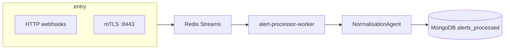

# Presentation deck — mTLS, Ingestion, Enrichment, Web App, Docker

Use this document as **speaker notes** or **slide bullets** for a technical walkthrough. It matches the current AI-SOC / Cybolt repo layout.

---

## Slide 1 — Agenda

1. **Docker** — what we build, what we run, how services connect  
2. **mTLS** — trust, certificates, SIEM ingress  
3. **Ingestion** — queues, workers, normalization  
4. **Enrichment** — MITRE, vectors, context on the alert  
5. **Web app (Cybolt)** — analyst UI and API  

---

## Slide 2 — Docker at a glance

| Artifact | Purpose |
|----------|---------|
| **`docker-compose.yml`** | Single network `soar-network`; wires MongoDB, Redis, Qdrant, Vault, Ollama, ML microservices, agentic API, **mTLS API**, **web-app-backend**, nginx, monitoring. |
| **`backend/Dockerfile`** | **Python 3.11**, CPU PyTorch first (smaller image), full `backend/requirements.txt`, non-root user `soar`. Produces image reused as **`soar-backend:latest`** for agentic, **stream worker**, ML services, dispatcher. |
| **`web_app/backend/Dockerfile`** | **Python 3.12-slim**, only Cybolt API deps; **`COPY app` + `scripts`**; **`uvicorn app.main:app`** on port **8000** (Compose maps host **8001**). |

**Important for demos**

- **SOAR backend** containers usually **bind-mount the repo** (`.:/app`) — live code without rebuilding the image.  
- **Cybolt API** image **does not** mount source in Compose — code changes need **`docker compose up -d --build web-app-backend`**.

---

## Slide 3 — `backend/Dockerfile` (SOAR monolith image)

**Goal:** one image, many processes (different `command` in Compose).

- Base: `python:3.11-slim` + build tools for native wheels.  
- **Torch:** install **CPU-only** `torch` from PyTorch index **before** the rest of requirements (avoids pulling a multi‑GB CUDA stack).  
- **App tree:** `COPY . .` at **repository root** context — imports use `PYTHONPATH=/app` and `backend.services...`.  
- **Security:** non-root user `soar` (uid 1000).  
- **Health (image default):** `curl` to `localhost:8000/health` — actual process may override port/module per service.

**Talking point:** “We optimize for **developer iteration** (volume mount) and **repeatable ML deps** (pinned torch + requirements).”

---

## Slide 4 — `web_app/backend/Dockerfile` (Cybolt API)

**Goal:** small, fast builds for the UI backend only.

- Base: `python:3.12-slim`.  
- Installs **`web_app/backend/requirements.txt`** only (not the full SOAR stack).  
- Copies **`app/`** (FastAPI) and **`scripts/`**.  
- **CMD:** `uvicorn app.main:app --host 0.0.0.0 --port 8000`.

**Talking point:** “Cybolt is **decoupled** from the heavy SOAR image — different Python version and dependency surface.”

---

## Slide 5 — mTLS — what problem it solves

- **SIEMs and agents** should not post alerts over plain anonymous HTTPS.  
- **mTLS** = server presents a cert; **client** presents a cert signed by a **SOAR-controlled CA**.  
- **Vault (dev)** holds PKI / policies; **AppRole** can issue short-lived certs for services.  
- **Application path:** verify identity, then forward trust headers to the FastAPI service.

**One-liner:** “We bind **cryptographic identity** to **ingestion** before the alert hits the queue.”

---

## Slide 6 — mTLS — runtime layout (Compose)

| Piece | Role |
|-------|------|
| **`vault`** | Dev-mode Vault; PKI engines after bootstrap (`vault-pki-bootstrap` profile). |
| **`vault-init`** | One-shot ACL / `pki_int` roles (`ensure-policies.sh`); **`api` waits on this**. |
| **`api` (`soar-mtls`)** | FastAPI **`backend.services.mtls.app`** on **8443** with **TLS** (server key/cert + CA). |
| **nginx `:8443`** | **mTLS ingress** for SIEM: TLS to clients, reverse-proxy to **`https://api:8443`**. |
| **Host `:8444`** | Direct TLS to mTLS FastAPI (testing / Swagger), bypasses nginx. |

**Config note:** nginx `soar.conf` listens on **8443**, sets `ssl_client_certificate` to the SOAR CA, and can forward **`X-SSL-Client-Cert`** for app-level checks. Upstream proxy uses `proxy_ssl_verify off` in dev because internal certs are often self-signed.

---

## Slide 7 — mTLS — talking points for security / platform

- **Bootstrap order:** PKI mount (`pki_int`) → **`vault-init` success** → **`api` container starts**.  
- **Production gap (be honest):** Vault **dev mode** and fixed root token are for **engineering only**; production needs HA Vault, proper sealing, and rotation.  
- **Cybolt integration:** Settings / cert flows can call **`MTLS_CERT_API_URL`** (default `https://api:8443/...` inside Compose).

---

## Slide 8 — Ingestion — end-to-end story

**Flow**

1. **Ingress:** Alerts arrive via **public/webhook APIs** and/or **mTLS-terminated** paths; validated and **pushed to Redis Streams** (async, back-pressure friendly).  
2. **`alert-processor-worker`:** `python -m backend.services.ingestion.stream_worker` — long-running consumer.  
3. **Inside worker:** **`NormalisationAgent`** (OCSF / ULF, AI mapper when needed), **`AlertProcessor`** (indexes, correlation hooks, etc.).  
4. **Persistence:** Normalized / enriched documents land in **MongoDB** (e.g. **`alerts_processed`**); failures can surface in **DLQ** collections / streams.

**Talking point:** “Ingestion is **decoupled from HTTP** — the worker is the **truth engine** that drains the queue.”

---

## Slide 9 — Ingestion — components to name-drop

| Component | File / module (indicative) |
|-----------|----------------------------|
| Redis Streams | `backend/services/ingestion/queue_manager.py` |
| Stream worker | `backend/services/ingestion/stream_worker.py` |
| Normalisation + MITRE hook-in | `backend/services/ingestion/normalisation_agent/` |
| Pipeline / correlation | `backend/services/ingestion/alert_pipeline.py` |

**Dependency:** Worker expects **MongoDB**, **Redis**, and (in Compose) **agentic-api healthy** for the full stack profile.

---

## Slide 10 — Enrichment — what we mean

**Enrichment** = attach **machine-readable context** to the normalized alert so analysts and automation can decide faster.

Typical buckets in this platform:

| Layer | Examples |
|-------|----------|
| **MITRE ATT&CK** | `enrichments.mitre` — technique/tactic, confidence, mapping method; **multi-layer** pipeline (rules, metadata extraction, vector/LLM assist). |
| **Vector / knowledge** | **Qdrant** collections (e.g. MITRE passages) for similarity / retrieval — see `mitre_enrichment_service.py` and indexing scripts under `scripts/setup/`. |
| **Threat intel** | Fields under enrichments (e.g. aggregate scores, per-indicator context) surfaced in the **web app alert detail**. |
| **Downstream ML** | Separate **HTTP microservices** (anomaly, attack stage, FP, asset risk, root cause) read from Mongo / Redis and **augment** scoring or queues — not always on the hot path of every alert. |

**Talking point:** “Enrichment is **structured fields on the document** plus **optional async ML** services.”

---

## Slide 11 — Enrichment — MITRE (deep dive option)

- **Service:** `MITREEnrichmentService` — layered pipeline (metadata extraction, Qdrant retrieval, LLM denoising where enabled).  
- **Output:** Written to **`alert['enrichments']['mitre']`**.  
- **Failure path:** Missing technique can route alerts to **`unmapped_alerts`** for analyst promotion (visible in Cybolt for Admin/Engineer).

---

## Slide 12 — Web app (Cybolt) — architecture

| Layer | Stack |
|-------|--------|
| **Frontend** | React 19, Vite, TypeScript, Tailwind, TanStack Query, Zustand, React Router. |
| **Backend** | FastAPI + Motor (async MongoDB), JWT auth, role permissions. |
| **Deploy** | **Docker:** `web-app-backend` → host **8001**. **Frontend:** `VITE_API_URL` → API base (often `http://localhost:8001`). |

**Routers (indicative):** `auth`, `admin`, `dashboard`, `analytics`, **`alerts`**, **`incidents`**, **`system`** (health), **`mtls_certs`** (proxy to PKI API), `settings`.

---

## Slide 13 — Web app — what analysts actually use

- **Alerts:** List / filter **`alerts_processed`**; detail view with MITRE, endpoints, enrichments, raw JSON.  
- **Review:** Manual review queue from **`incidents`**; unmapped queue from **`unmapped_alerts`**.  
- **Feedback:** Plan feedback → **`feedback_collection`** (aligned with SOAR PlanFeedback-style docs).  
- **System analytics:** **`GET /system/health`** (Admin/Engineer) — probes Mongo + TCP/HTTP to sibling services (Vault, Redis, agentic, ML URLs).  

---

## Slide 14 — How the five topics fit together

| Topic | Responsibility |
|-------|----------------|
| **Docker** | Reproducible runtime, isolated dependencies, service discovery on `soar-network`. |
| **mTLS** | **Strong identity** at the edge for high-trust ingestion. |
| **Ingestion** | **Durable queue** + **normalization** into a single OCSF-oriented document model. |
| **Enrichment** | **Context + ML** on that document (and sidecar services). |
| **Web app** | **Human workflow** — triage, review, feedback, operational visibility. |

---

## Slide 15 — Q&A cheatsheet

- **“Where is the alert canonical record?”** → MongoDB **`alerts_processed`** (ingestion output).  
- **“What if MITRE fails?”** → **`unmapped_alerts`** + analyst promote flow in UI.  
- **“Why two Python versions?”** → SOAR **3.11** (ML/torch stack), Cybolt API **3.12** (lighter image).  
- **“Why is Vault red in System Health?”** → Often **localhost vs `vault` hostname** inside Docker; Compose should set **`VAULT_ADDR=http://vault:8200`** for `web-app-backend`.  

---

## References in-repo

| Doc / path | Content |
|------------|---------|
| `docs/Platform_Architecture_CTO_Brief.md` | Full stack catalog, ports, Vault bootstrap. |
| `docker-compose.yml` | Service names, ports, `depends_on`, build contexts. |
| `infra/docker/nginx/conf.d/soar.conf` | mTLS server block on 8443. |
| `backend/services/mtls/app/` | mTLS FastAPI application factory. |
| `backend/services/ingestion/stream_worker.py` | Ingestion worker entry. |
| `web_app/backend/app/main.py` | Cybolt API assembly. |

---

*Generated for presentation use; verify ports and env against your environment before customer-facing slides.*
