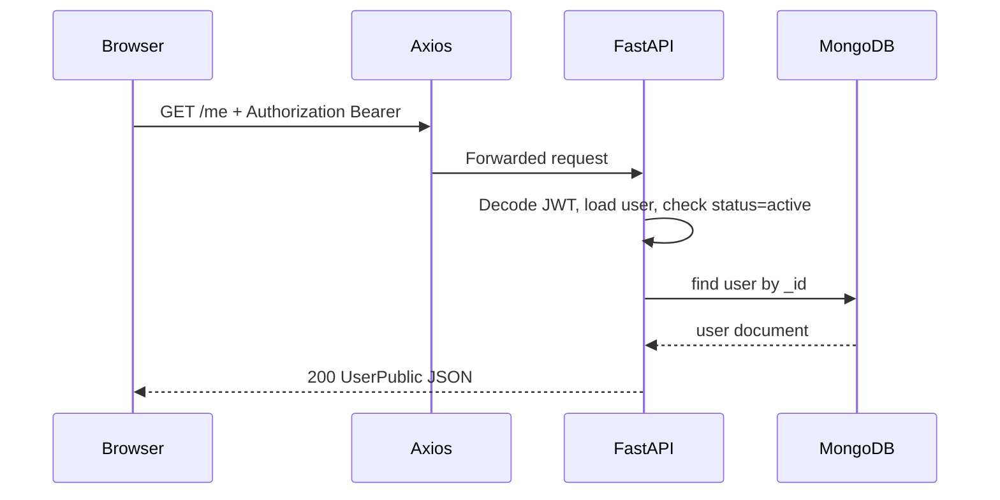

# Architecture

## Repository layout

```
web_app/                          # under AI-SOC monorepo
├── docs/                         # this documentation
├── frontend/                     # Vite + React + TypeScript
│   ├── .env.example              # VITE_API_URL for FastAPI base URL
│   ├── src/
│   │   ├── App.tsx               # routes + providers
│   │   ├── main.tsx              # auth token getter registration
│   │   ├── components/         # layout, UI primitives, auth bootstrap
│   │   ├── pages/              # dashboard, alerts, login, register, …
│   │   ├── hooks/              # TanStack Query (mostly mock-backed)
│   │   ├── store/              # Zustand (app UI + authStore)
│   │   ├── lib/                # api.ts (axios), auth-api.ts, utils
│   │   └── data/               # mockAlerts, etc.
│   ├── package.json
│   └── vite.config.ts
└── backend/                      # FastAPI application
    ├── Dockerfile
    ├── requirements.txt
    ├── scripts/
    │   └── seed_roles.py         # optional CLI to seed roles
    └── app/
        ├── main.py               # app factory, CORS, lifespan
        ├── db.py                 # Motor Mongo client
        ├── core/                 # settings, JWT, password hashing
        ├── models/               # collection name constants
        ├── schemas/              # Pydantic request/response models
        ├── routes/               # auth.py, admin.py
        ├── dependencies/         # get_current_user, require_permission
        ├── services/             # permissions, seed_roles, audit
        └── utils/
```

## Technology stack

### Frontend

| Layer | Choice |
|-------|--------|
| Framework | React 18+, Vite |
| Styling | Tailwind CSS v4 (`@tailwindcss/vite`), shadcn-style Radix components |
| Routing | React Router v6 |
| Server state | TanStack Query v5 (mock endpoints today) |
| Client state | Zustand (`useAppStore`, `useAuthStore` with persist) |
| HTTP | Axios (`src/lib/api.ts`) with Bearer injection for auth |
| Charts | Recharts |

### Backend

| Layer | Choice |
|-------|--------|
| Framework | FastAPI |
| Database | MongoDB 7, async driver **Motor** |
| Auth | JWT (HS256), **Passlib** bcrypt for passwords |
| Validation | Pydantic v2 |

### Infrastructure

| Component | Role |
|-----------|------|
| AI-SOC `docker-compose.yml` | Service **`web-app-backend`** (port **8001**); MongoDB is the platform **`mongodb`** service |
| `backend/Dockerfile` | Python 3.12, uvicorn |
| Root `.env` | AI-SOC repo; `MONGODB_*` and `JWT_SECRET` for the web API |

## Request flow (authenticated API call)



## Security notes (current)

- Passwords are **never** stored plain text; bcrypt via Passlib.
- JWT secret must be set in production (`JWT_SECRET`); default in compose is a placeholder.
- CORS is `allow_origins=["*"]` for development — **tighten** for production.
- MongoDB in compose is **not** published to the host (only `backend` exposes 8001).
