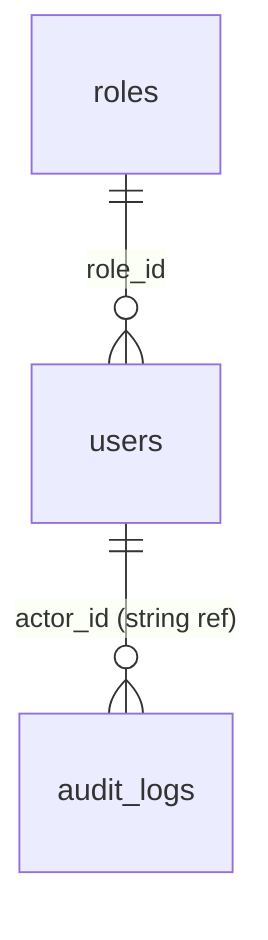

# Data model (MongoDB)

Database name: configurable via `MONGODB_DATABASE` (default **`soar_db`**).  
Connection: **`MONGO_URI`** (see [Operations](operations.md)).

---

## Collection: `roles`

| Field | Type | Description |
|-------|------|-------------|
| `_id` | ObjectId | Primary key |
| `name` | string | Role name: `Admin`, `L1`, `L2`, `L3`, `Engineer` |
| `permissions` | object | See below |

### `permissions` object

| Field | Type | Description |
|-------|------|-------------|
| `user_management` | boolean | Approve/reject, assign roles |
| `dashboard_access` | boolean | Placeholder for future gating |
| `backend_access` | boolean | Placeholder for future gating |

**Seed defaults** (see `backend/app/services/seed_roles.py`):

- **Admin:** all three `true`.
- **L1:** dashboard only (`backend_access` false).
- **L2–L3, Engineer:** `dashboard_access` + `backend_access` true, `user_management` false.

---

## Collection: `users`

| Field | Type | Description |
|-------|------|-------------|
| `_id` | ObjectId | Primary key |
| `name` | string | Display name |
| `email` | string | Unique (index), lowercased on write |
| `hashed_password` | string | bcrypt (Passlib) |
| `role_id` | ObjectId \| null | Reference to `roles._id`; null until assigned |
| `status` | string | `"pending"` \| `"active"` \| `"rejected"` |
| `is_superadmin` | boolean | Bootstrap user; cannot be rejected/demoted via normal admin actions |
| `created_at` | datetime (UTC) | Set on insert |
| `updated_at` | datetime (UTC) | Updated on relevant changes |

**Indexes**

- Unique index on **`email`**.

---

## Collection: `audit_logs`

Written for admin actions (bonus feature).

| Field | Type | Description |
|-------|------|-------------|
| `_id` | ObjectId | Primary key |
| `action` | string | e.g. `user_approved`, `user_rejected`, `role_assigned` |
| `actor_id` | string | User id (hex) who performed the action |
| `target_user_id` | string \| null | Affected user id when applicable |
| `details` | object | Extra payload (e.g. role name on assign) |
| `created_at` | datetime (UTC) | Event time |

---

## Entity relationships

*Note: `audit_logs` stores string ids, not MongoDB refs — convenient for querying without joins.*
