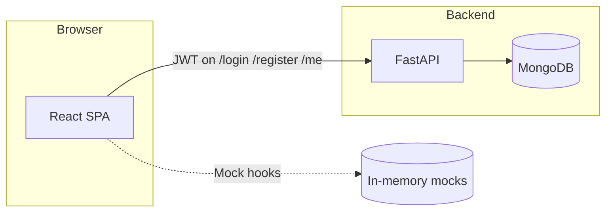

# Overview

## What is Cybolt?

**Cybolt** is a monorepo containing:

1. **Frontend** (`frontend/`) — A React + Vite single-page application styled as an enterprise SOAR-style UI (dashboards, alerts, analytics, settings, etc.). Much of the **data is still mock/local** for iteration.
2. **Backend** (`backend/`) — A **FastAPI** service providing **authentication, user lifecycle, and RBAC** backed by **MongoDB**. It does **not** implement SOC/alert ingestion logic yet.

The two services are **loosely coupled**: the UI can run against mock data while the API handles real users and JWTs for the parts that are wired (sign-in, register, session).

## Current integration status

| Area | Status |
|------|--------|
| User registration & login | **Connected** — UI calls `POST /register`, `POST /login`, `GET /me` |
| JWT storage & top bar | **Connected** — Zustand + `localStorage`, axios interceptor |
| Dashboard, alerts, analytics, system health, etc. | **Mock only** — TanStack Query hooks use in-memory mock data (`MOCK = true` pattern) |
| Admin approve/reject/assign-role | **API exists** — not yet exposed as dedicated UI screens (callable via `/docs` or HTTP client) |

## High-level diagram

## Documentation map

- **New developers**: read [Architecture](architecture.md) → [Workflows](workflows.md) → [API reference](api-reference.md).
- **Operators**: [Operations](operations.md) and [Data model](data-model.md).
- **Frontend work**: [Frontend](frontend.md).
